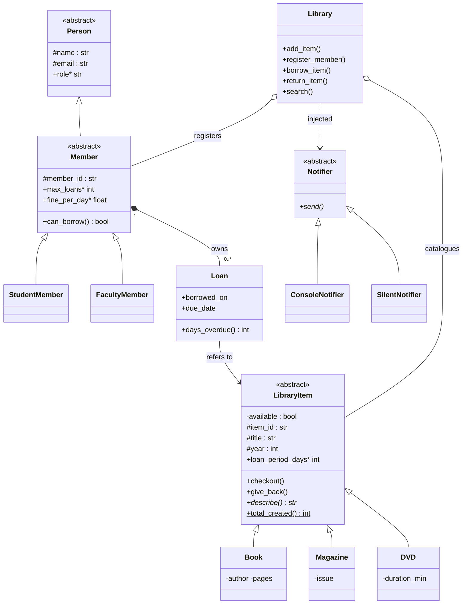
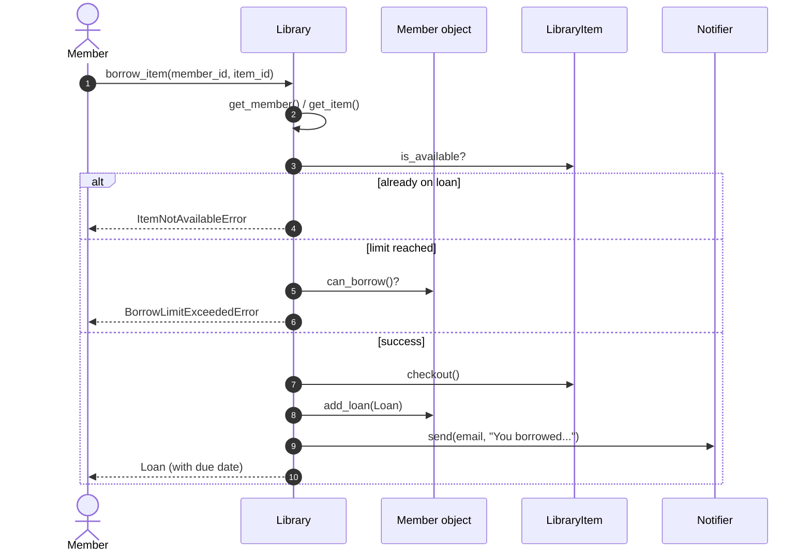

<div align="center">



<br/>


-5b3a7a?style=for-the-badge)

**[The Story](#-the-story)** •
**[Features](#-features)** •
**[OOP Catalogue](#-the-oop-catalogue)** •
**[Architecture](#-architecture)** •
**[Quick Start](#-quick-start)** •
**[Live Demo](#-live-demo)** •
**[Tests](#-tests)** •
**[Author](#-author)**

</div>

<div align="center"></div>

## 📖 The Story

Every library runs on invisible rules. A student may hold three books, a professor ten. A magazine goes home for a week, a DVD for three days. A book cannot be lent twice, and a late return costs a few coins.

This project turns those rules into code. Instead of a tangle of `if` statements, each rule lives where it belongs: inside the **object** that owns it. A `StudentMember` *knows* its own limit. A `DVD` *knows* its own loan period. The `Library` simply coordinates them and never needs to ask what kind of item it is holding.

That is Object-Oriented Programming at work: small, honest objects, each responsible for itself.

## 📝 Project Description

**Library Management System** is a console-based Python application for managing library items (books, magazines, DVDs) and members (students, faculty). Members borrow and return items, the library enforces per-member borrowing limits, calculates late fines, and sends notifications through an injected notifier. Every class validates its own data and raises meaningful custom exceptions.

It was built to demonstrate the core OOP concepts in a practical, clean, and fully tested codebase, with **zero external dependencies**.

<div align="center"></div>

## ✨ Features

| | Feature | Details |
|:-:|---|---|
| 📚 | **Multiple item types** | Books, magazines and DVDs, each with its own loan period |
| 👥 | **Two member types** | Students and faculty, with different limits and fines |
| 🔄 | **Borrow & return** | Automatic due dates, availability tracking |
| 💰 | **Late fines** | Calculated per overdue day, based on the member type |
| 🔎 | **Search** | Case-insensitive title search and list of available items |
| 🔔 | **Notifications** | Pluggable notifier (console or silent) via dependency injection |
| 🛡️ | **Robust validation** | Every constructor rejects invalid data |
| 🚨 | **Custom exceptions** | A clean error hierarchy under `LibraryError` |
| 🧪 | **Unit tests** | Borrowing, limits, fines, validation and abstraction |

### 📏 Library Rules

| Item type | Loan period | | Member type | Max loans | Fine / day |
|---|:-:|-|---|:-:|:-:|
| 📕 Book | 21 days | | 🎓 Student | 3 | $0.50 |
| 📰 Magazine | 7 days | | 🧑‍🏫 Faculty | 10 | $0.25 |
| 💿 DVD | 3 days | | | | |

<div align="center"></div>

## 🏛️ The OOP Catalogue

Every required concept has its own shelf in this project.

| 🔖 Concept | 📍 Where to find it | 💡 How it is used |
|---|---|---|
| **Classes & Objects** | `Library`, `Book`, `Magazine`, `DVD`, `StudentMember`, `FacultyMember`, `Loan` | Each real-world entity is modeled as a class |
| **Encapsulation** | `LibraryItem` | Private `__available` flag, protected attributes, read-only `@property` accessors, and `active_loans` returns a copy |
| **Abstraction** | `LibraryItem`, `Person`, `Member`, `Notifier` | Abstract base classes with `@abstractmethod`; they cannot be instantiated |
| **Inheritance** | `Book → LibraryItem`, `StudentMember → Member → Person` | Shared behavior in parents, specifics in children (multilevel) |
| **Polymorphism** | `describe()`, `loan_period_days`, `max_loans`, `fine_per_day` | The `Library` treats all items and members uniformly |
| **Constructors** | Every class | Validate input, then call `super().__init__()` |
| **Exception Handling** | `library/exceptions.py` | Custom hierarchy plus `try/except` in the demo |
| **Composition** | `Member` ◆→ `Loan` | A member owns its loans |
| **Aggregation** | `Library` ◇→ items and members | Items and members exist independently of the library |
| **Dependency Injection** | `Library(notifier=...)` | The notifier is passed in, not hard-wired (loose coupling) |
| **Static / class members** | `LibraryItem._items_created`, `total_created()` | State shared across all items |

<details>
<summary><b>🔍 See encapsulation in action</b></summary>

```python
class LibraryItem(ABC):
    def __init__(self, item_id, title, year):
        ...
        self.__available = True          # private: cannot be changed from outside

    @property
    def is_available(self) -> bool:      # read-only access
        return self.__available

    def checkout(self) -> None:          # the only way to change the state
        if not self.__available:
            raise ItemNotAvailableError(f"'{self._title}' is already on loan.")
        self.__available = False
```
</details>

<details>
<summary><b>🔍 See abstraction and polymorphism in action</b></summary>

```python
class LibraryItem(ABC):
    @property
    @abstractmethod
    def loan_period_days(self) -> int: ...

class Book(LibraryItem):
    @property
    def loan_period_days(self) -> int:
        return 21

class DVD(LibraryItem):
    @property
    def loan_period_days(self) -> int:
        return 3

# The Library never checks the type. It just asks the object.
due_date = borrowed_on + timedelta(days=item.loan_period_days)
```
</details>

<details>
<summary><b>🔍 See dependency injection in action</b></summary>

```python
class Library:
    def __init__(self, name, notifier: Optional[Notifier] = None):
        self._notifier = notifier or ConsoleNotifier()

# Production
lib = Library("Central Library")

# Tests: swap the notifier without touching Library
lib = Library("Test Library", notifier=SilentNotifier())
```
</details>

<div align="center"></div>

## 🧩 Architecture

### Class diagram



### What happens when someone borrows a book



### Exception hierarchy

```text
LibraryError
├── InvalidDataError           bad constructor input
├── ItemNotFoundError          unknown item ID
├── MemberNotFoundError        unknown member ID
├── ItemNotAvailableError      item already on loan
├── BorrowLimitExceededError   member is at their limit
└── LoanNotFoundError          returning something never borrowed
```

<div align="center"></div>

## 🚀 Quick Start

Requires **Python 3.9+**. No packages to install.

```bash
# 1. Clone the repository
git clone https://github.com/<your-username>/library-management-system.git
cd library-management-system

# 2. Run the demo
python main.py

# 3. Run the tests
python -m unittest discover -s tests -v
```

### Use it in your own code

```python
from library import Library, Book, StudentMember

lib = Library("City Library")
lib.add_item(Book("B1", "Clean Code", 2008, "Robert C. Martin", 464))
lib.register_member(StudentMember("S1", "Yasser", "yasser@example.com"))

loan = lib.borrow_item("S1", "B1")
print(loan)                        # Clean Code (due 2026-10-15)

fine = lib.return_item("S1", "B1") # 0.0 if returned on time
```

## 🎬 Live Demo

Running `python main.py` produces (dates depend on the day you run it):

```text
=== Adding items and members ===
[B1] Book: 'Clean Code' by Robert C. Martin, 2008, 464 pages (available)
[B2] Book: 'Fluent Python' by Luciano Ramalho, 2015, 792 pages (available)
[M1] Magazine: 'Wired' issue #5, 2024 (available)
[D1] DVD: 'The Social Network', 2010, 120 min (available)

=== Borrowing ===
  -> notification to yasser@example.com: You borrowed 'Clean Code'. Due 2026-10-15.
  -> notification to yasser@example.com: You borrowed 'Wired'. Due 2026-10-01.
Student Yasser (S1) - 2/3 loans

=== Error handling ===
  ! ItemNotAvailableError: 'Clean Code' is already on loan.
  ! MemberNotFoundError: No member with ID 'S9'.
  ! ItemNotFoundError: No item with ID 'X99'.
  ! BorrowLimitExceededError: Yasser reached the limit of 3 loans.

=== Returning (late DVD, 5 days overdue) ===
  -> notification to yasser@example.com: You returned 'The Social Network'. Late fine: $2.50.
Fine charged: $2.50
```

<div align="center"></div>

## 🧪 Tests

```bash
python -m unittest discover -s tests -v
```

| Test | What it proves |
|---|---|
| `test_cannot_instantiate_abstract_class` | Abstraction is enforced |
| `test_invalid_data` | Constructors validate input |
| `test_borrow_and_double_borrow` | Availability rules and exceptions work |
| `test_limits_differ_by_member_type` | Polymorphic limits (student vs faculty) |
| `test_fine_calculation` | Fines are computed correctly |
| `test_return_without_borrow` | Returning a never-borrowed item is rejected |

## 🗂️ Project Structure

```text
library-management-system/
├── 📄 main.py                 Demo script
├── 📦 library/
│   ├── __init__.py            Public API
│   ├── exceptions.py          Custom exception hierarchy
│   ├── models.py              LibraryItem, Book, Magazine, DVD, Loan
│   ├── members.py             Person, Member, StudentMember, FacultyMember
│   ├── notifier.py            Notifier, ConsoleNotifier, SilentNotifier
│   └── library.py             Library service
├── 🧪 tests/
│   └── test_library.py
├── 📚 docs/
│   └── OOP_Concepts.md        Answers to Tasks 1-20
├── 🎨 assets/                 README artwork
├── .gitignore
└── README.md
```

## 🛠️ Implementation

This project is implemented as a **multi-file Python project** (bonus option), organized into logical modules for better structure and closer to real-world development practices.

## 📚 Concept Notes

The conceptual tasks (Tasks 1-20: class vs object, encapsulation vs abstraction, shallow vs deep copy, and more) are answered with comparison tables and code examples in **[`docs/OOP_Concepts.md`](docs/OOP_Concepts.md)**.

## 🔭 Ideas for the Next Chapter

- Save and load the catalogue from JSON or SQLite
- Interactive command-line menu
- Reservations and waiting lists
- `Protocol`-based interfaces with static type checking

<div align="center"></div>

## 👤 Author

**Yasser**
Data Scientist and BI Engineer

[](https://github.com/Yasser-Mogahed)

<br/>

<div align="center">

</div>
